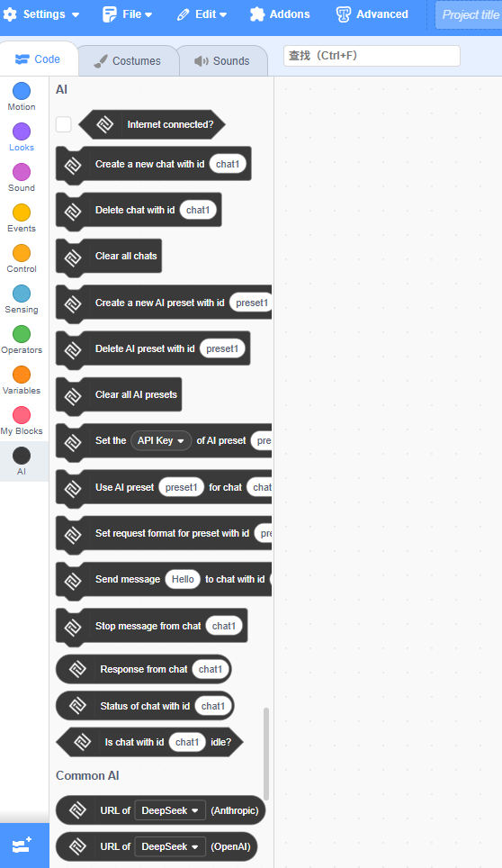

## Introduction

This is a Scratch extension that connects to AI services. It allows you to chat with an AI directly in Scratch by calling the OpenAI and Anthropic APIs, with support for streaming responses.

## Quick Start

The file [./samples/sample.sb3](./samples/sample.sb3) is an example for this extension, and you can open it in TurboWarp to use it.

## Security & Disclaimer

This extension requires API keys to function. Since these keys are stored in the Scratch environment, they may be accessible to other scripts or extensions running simultaneously. **We strongly recommend**:

- Using this extension only in isolated or trusted environments.
- Avoiding the use of untrusted extensions alongside it.
- Resetting your API keys promptly if any exposure is suspected.

**Disclaimer:** This tool is provided "as is" without any warranty. The authors assume no liability for any unauthorized use of your API keys or quota consumption that may result from using this extension. You are solely responsible for safeguarding your credentials.

## Editions

This extension provides different versions for different Scratch editors. Note that only [./src/index.js](./src/index.js) fully complies with the official TurboWarp extension specifications.

- **For Gandi**: [./src/ccw.js](./src/ccw.js)

  - Changed `Scratch.fetch` to `fetch`, since Gandi removed this API.
  - Replaced `Scratch.translate` with a custom lightweight function that supports seven languages.
- **For TurboWarp**: [./src/tw.js](./src/tw.js)
  - Based on the Gandi version, but uses `Scratch.fetch` instead of `fetch`. Still does not fully comply with TurboWarp specifications.
  - **When using this extension on Turbowarp, it's best to use this version.**
- **Standard Version**: [./src/index.js](./src/index.js)

  - Fully compliant with TurboWarp extension standards. No modified functions.

**Tip:** [./src/setup.js](./src/setup.js) contains translations for all seven supported languages.

## Images

All images in this extension were made using Adobe Illustrator, including the original files and the exported image assets. You can check them out in directory [./images](./images), all of these are also open-sourced under the MIT license.

## Use of AI

Some logic in this extension was drafted by AI, but all of it was thoroughly reviewed and improved by humans.

**Note:** The multilingual parts of this extension were largely generated by translators or AI, as the author is not a native speaker of these languages. Some sentences may not read perfectly smoothly.

## Distribution

You are free to copy the code of this extension to your own website or others, as long as you give credit to the original author—either by name or by linking to this repository.

As the author, I would prefer that no one creates closed-source or sells modified versions of this extension. While this is permitted by the license, I believe it goes against the spirit of open source.

## Author

@Kimos Frontender

QQ Mail: 3213910856@qq.com

Sina Mail: mnbvcxz143889@sina.com

[Scratch](scratch.mit.edu/users/Kimos-Frontender/https:/)

[Github](https://github.com/kms413)
